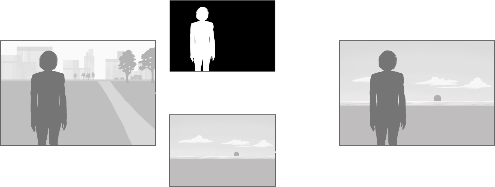

# Vision - Person Segmentation

## Overview

[Vision](https://developer.apple.com/documentation/vision) framework được giới thiệu lần đầu vào WWDC 2017. Vision giúp thực hiện phát hiện khuôn mặt, phát hiện văn bản, nhận dạng mã vạch, đăng ký hình ảnh... Vision cũng cho phép sử dụng Core ML để tùy chỉnh cho các tác vụ như phân loại hoặc phát hiện đối tượng.

Trong sample này chúng ta sẽ cùng tìm hiểu Person Segmentation API, giúp ứng dụng của bạn tách mọi người trong hình ảnh khỏi môi trường xung quanh.



> **Notes**:
*Sample yêu cầu chạy **Physical device** với ios 15+ hoặc chạy **Simulator** ios 15+ trên macOS chip Intel*

## Cách tạo một Vision requests

Muốn sử dụng bất kỳ thuật toán nào của Vision, bạn sẽ cần ba bước:

1. [Request:](#request) Yêu cầu xác định loại thứ bạn muốn phát hiện và một trình xử lý hoàn thành sẽ xử lý kết quả. Đây là subclass của [VNRequest](https://developer.apple.com/documentation/vision/vnrequest).

2. [Request handler:](#request-handler) Sử dụng [VNImageRequestHandler](https://developer.apple.com/documentation/vision/vnimagerequesthandler) để thực hiện Request.

3. [Results:](#results) Kết quả sẽ được đính kèm với Request ban đầu và được chuyển đến trình xử lý hoàn thành được xác định khi tạo Request. Chúng là các subclass của [VNObservation](https://developer.apple.com/documentation/vision/vnobservation).

## Prepare the Requests

```swift
// 1. Request
let request = VNGeneratePersonSegmentationRequest { (request, error) in
    // 3. Results
    self.personSegmentation(request: request, error: error)
}
        
request.qualityLevel = .accurate
request.outputPixelFormat = kCVPixelFormatType_OneComponent8
        
// 2. Request Handler
let imageRequestHandle = VNImageRequestHandler(cgImage: cgImage, options: [:])
```

Chúng ta sẽ tạo 1 request với [VNGeneratePersonSegmentationRequest](https://developer.apple.com/documentation/vision/vndetectfacerectanglesrequest). **VNGeneratePersonSegmentationRequest** giúp tạo mask hình ảnh cho người mà nó phát hiện trong hình ảnh. Việc set thuộc tính [qualityLevel](https://developer.apple.com/documentation/vision/vngeneratepersonsegmentationrequest/3750989-qualitylevel) cho request thành **.fast**, **.balanced**, hoặc **.accurate** giúp xác định chất lượng của mask được tạo như trong hình minh họa bên dưới.


Việc tăng độ chính xác của mask cũng đồng hời làm giảm suất làm việc của app nên chúng ta cần lựa chọn qualityLevel phù hợp cho từng tác vụ mà nó xử lý


Thuộc tính tiếp theo là format đầu ra của mask: [outputPixelFormat](https://developer.apple.com/documentation/vision/vngenerateopticalflowrequest/3548304-outputpixelformat?language=objc). **outputPixelFormat** định dạng mà mặt nạ kết quả sẽ được trả về, có 3 định dạng có thể chọn đó là:


Trong sample chúng ta set **outputPixelFormat** với kCVPixelFormatType_OneComponent8 với range từ 0 đến 255.

Bước cuối cùng là thực hiện request với `VNImageRequestHandler` đã tạo từ trước. result trả về của request handle sẽ là 1 instance của [VNPixelBufferObservation](https://developer.apple.com/documentation/vision/vnpixelbufferobservation)

```swift
DispatchQueue.global(qos: .userInitiated).async {
    do {
        try imageRequestHandle.perform([request])
    } catch let error {
        print(error)
    }
}
```

## Xử lý Results


Chúng ta đã tìm hiểu qua về request và các thuộc tính của nó, ta sẽ đến với phần tiếp theo là xử lý result trả về. Những gì ta cần làm ở đây là thay thế background của ảnh gốc nằm ngoài mask trả về từ result.

```swift
guard let result = request.results?.first as? VNPixelBufferObservation else {
    loadingView.stopAnimating()
    return
}
// 1. Processing
let buffer: CVPixelBuffer = result.pixelBuffer
let maskImage: CIImage = CIImage(cvImageBuffer: buffer)
let bgImage = UIImage(named: "background")!
let background = CIImage(cgImage: bgImage.cgImage!)
let input = UIImage(named: "humanFace")!
let inputImage = CIImage(cgImage: input.cgImage!)
        
// 2. Scale mask, and background to size of original image
let maskScaleX = inputImage.extent.width / maskImage.extent.width
let maskScaleY = inputImage.extent.height / maskImage.extent.height
let maskScaled =  maskImage.transformed(by: __CGAffineTransformMake(maskScaleX, 0, 0, maskScaleY, 0, 0))
        
let backgroundScaleX = inputImage.extent.width / background.extent.width
let backgroundScaleY = inputImage.extent.height / background.extent.height
let backgroundScaled =  background.transformed(by: __CGAffineTransformMake(backgroundScaleX, 0, 0, backgroundScaleY, 0, 0))
        
// 3. Blending Image
let blendFilter = CIFilter.blendWithMask()
blendFilter.inputImage = inputImage
blendFilter.maskImage = maskScaled
blendFilter.backgroundImage = backgroundScaled

// 4. Handle Result
if let blendedImage = blendFilter.outputImage {
    let context = CIContext(options: nil)
    let maskDisplayRef = context.createCGImage(maskScaled, from: maskScaled.extent)
    let filteredImageRef = context.createCGImage(blendedImage, from: blendedImage.extent)
    DispatchQueue.main.async {
        self.imageDisplay.image = UIImage(cgImage: filteredImageRef!)
        self.maskImage.image = UIImage(cgImage: maskDisplayRef!)
    }
}
```

Đây là những gì ta làm trong đoạn code trên:

1. Import ảnh gốc, hình nền cần thay thế và mask từ result trả về.

2. Scale kích thước của mask và hình nền về size của ảnh gốc.

3. Tạo ra 1 CoreImage blend filter, ta dùng `blendWithRedMask()` vì khi tạo ra CIImage của mask từ **CVPixelBuffer** của nó, nó sẽ tạo ra 1 object mặc định ở [red chanel](https://en.wikipedia.org/wiki/Channel_(digital_image)).

4. Xử lý result filter, update UI.

Đây là kết quả sau khi đã xử lý xong:


## Kết luận

Qua bài viết này mình muốn chia sẻ tới mọi người trình tự tạo một Vision requests, hiểu hơn về Person Segmentation API và cách sử dụng của nó. Mong rằng bài viết tới mình có thể chia sẻ tới các bạn cách sử dụng của Person Segmentation API với video.

## Refer

* [Detect people, faces, and poses using Vision](https://developer.apple.com/videos/play/wwdc2021/10040/)

* Bạn có thể tham khảo full source tại [GitHub Repository](https://github.com/LamND14-01/VisionPersonSegmentation).
